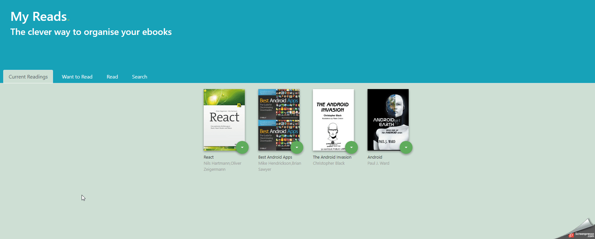

# MyReads. - The clever way to organise your ebooks
This app helps you to organise your ebooks. You can categorize your books in three shelves:
* Currently Reading
* Want to Read
* Read
  
Each book has a control that lets you select the shelf for that book. When you select a different shelf, the book moves there.
The main page also has a link to /search, a search page that allows you to find books to add to your library.



This app was created for the Udacity React Nanodegree Program. The goal of the project was to gain more experience with the REACT Framework.

1. Getting Started
    1) 1.1. Run a demo locally
    1) 1.2. Folder Structure explained
2. Licenses
    1) 2.1. About this Application
    2) 2.2 Third Party Content

### 1. Getting Started
These instructions cover the setup and installation on your local machine for developing and testing purposes.
#### 1.1. Run a demo locally
* install all project dependencies with `npm install`
* start the development server with `npm start`
#### 1.2. Folder Structure explained
```
├── CONTRIBUTING.md
├── README.md - This file.
├── SEARCH_TERMS.md # The whitelisted short collection of available search terms.
├── package.json # npm package manager file.
├── public
│   ├── favicon.ico # 
│   └── index.html # DO NOT MODIFY
└── src
    ├── components: Contains all components which are use in App.js
        ├── Footer: 
            └── Footer.js: 
        ├── Header:
            └── HeadSection.js
        └── Tabs: 
            ├── BookCard.js
            ├── Books.API.js
            └── BookShelf.js
            └── Searchpage.js
    ├── App.css # Styles for the app
    ├── App.js # This is the root of your app. Contains static HTML right now.
    ├── App.test.js # Used for testing. Provided with Create React App. Testing is encouraged, but not required.
    ├── BooksAPI.js # A JavaScript API for the provided Udacity backend. Instructions for the methods are below.
    ├── icons #  images the app.
        ├── add.svg
        ├── arrow-back.svg
        └── arrow-drop-down.svg
    ├── index.css # Global styles.
    └── index.js #DO NOT MODIFY
```
### 2. Licenses
* This project was bootstrapped with [Create React App](https://github.com/facebookincubator/create-react-app). You can find more information on how to perform common tasks [here](https://github.com/facebookincubator/create-react-app/blob/master/packages/react-scripts/template/README.md).
* A Project [starter code](https://github.com/udacity/reactnd-project-myreads-starter) contributed by Udacity

The following source where used for the img tags:
* Icon: Source https://www.flaticon.com/authors/payungkead


